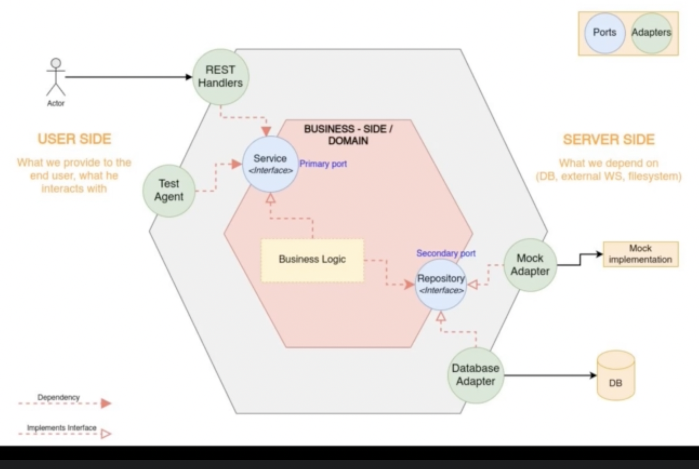

# hexagonal-architecture-rest

This is a little off the track, but we make some progress in structuring our REST api.

Read about [Hexagonal architecture](https://www.qwan.eu/2020/08/20/hexagonal-architecture.html) in detail here.

The below diagram is a hexagonal architectural representation of the code in this module.

## Implementation
* We start with domain, then we add interfaces for different ports, i.e., **Customer Repository** (Secondary Port) and **Customer Service** (Primary Port).  
* After that we implement the Repository Stub that must implement the Repository Port interface. Our business logic is dependent on this Secondary Port.  
* **Customer Service** drives the technical specifications and determines an interface that our business logic must implement. Note how this service is dependent on **Customer Repository**.
* After this, we can move to defining REST handlers which initialize the Customer service with the right Customer Repository.
* **Customer Service** and **Customer Repository** ports comprise our business logic.  
* Repository Stub and REST Handlers are adapters.