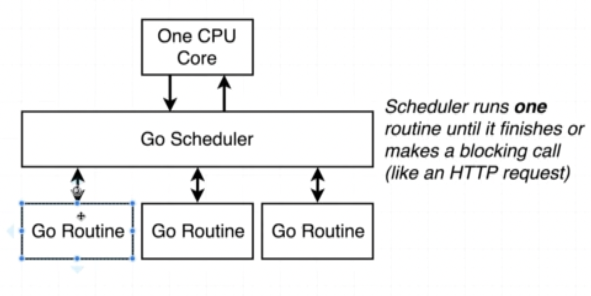
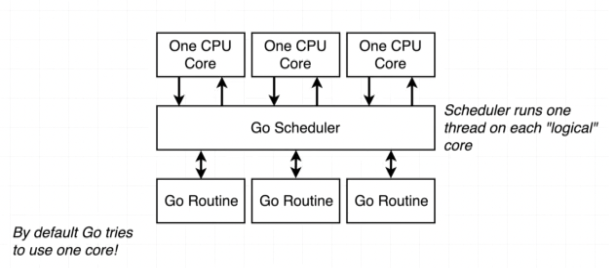

# Routines

In an application, there are many blocking requests such as network and database calls.

## Concurrency

To handle that in go, we use routines with functions.  

Go routines make use of Go scheduler to block the CPU thread they are part of and execute the code.  

Whenever go encouters a blocking call, it sets aside that routine and executes code in some other routine which is not blocking. And when the routine wakes up from finishing the blocking call, it then gets executed by the scheduler. This is part of the concurrency model.

## Parallel Execution

Each concurrent execution can be done by making use of each **logical** core from CPU.