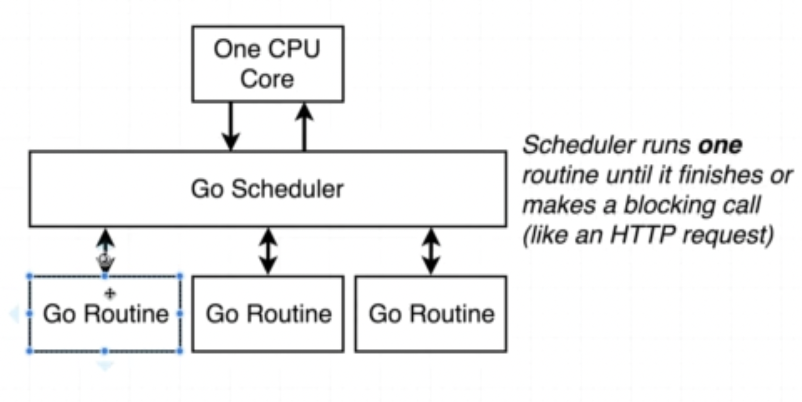
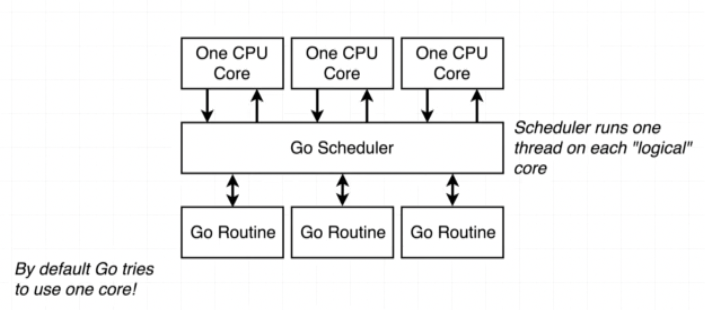
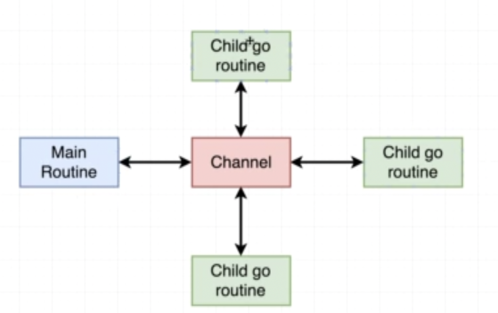

# Concurrency

[Go Tour - Concurrency](https://go.dev/tour/concurrency/1)

## Routines

In an application, there are many blocking requests such as network and database calls.


To handle that in go, we use routines with functions.  

Go routines make use of Go scheduler to block the CPU thread they are part of and execute the code.  

Whenever go encouters a blocking call, it sets aside that routine and executes code in some other routine which is not blocking. And when the routine wakes up from finishing the blocking call, it then gets executed by the scheduler. This is part of the concurrency model.

## Parallel Execution

Each concurrent execution can be done by making use of each **logical** core from CPU.

## Channels

Since routines run independently and main routine controls the termination of our program, we need to have some communication among routines.  

Channels help in setting up that communication.  

Channels have their defined data types and can be passed as arguments into routines.

Use the following syntax to send and retreive message to and fro with channels:

```go
// Sending message into the channel
c <- data

// Retreiving message from channel
someVariable <- c
```

> Note
> * Retreival of messages from the channel can be done atmost the same exact number of times as sending the message into the channel, we can ignore messages if we do not care about them. But if we expect a message from the channel, we must send the message as well; otherwise it will block the execution.  
> * Sending message into channels is only possible through routines. Calling a function with channels without using the `go` keyword and sending message into the channel will result in program crashing.


For non-blocking part of the code, we can't rely on any routine getting executed before other routines.
They can get executed in any order for non-blocking parts of the code.

But we can safely say that since all go routines will have a listener,
the program will terminate after all go routines each will have sent a message.


## Learn More

* [Concurrency is not parallelism](https://go.dev/blog/waza-talk)
* [Futures in Go, no package required](https://appliedgo.net/futures/)
* [Rethinking Classical Concurrency Patterns](https://www.youtube.com/watch?v=5zXAHh5tJqQ)
